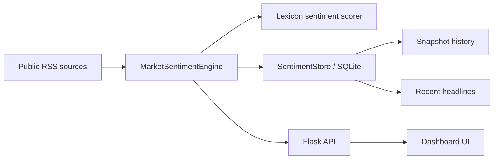

# Market Sentiment Engine

An end-to-end market sentiment analytics app that ingests public finance headlines, scores them with a lightweight NLP model, stores snapshots in SQLite, and presents the result through a clean dashboard and JSON API.

This repo started as a feature prototype and was refactored into a standalone project so it can be shown, tested, and deployed independently.

## Why this exists

The goal is to demonstrate a complete, explainable product:

- a data ingestion pipeline
- a scoring engine
- a persistence layer
- a demo-friendly dashboard
- an API that another service can consume

## What problem it solves

Most “sentiment” demos stop at a chart or a single score. This project goes further:

- it fetches real external data
- it turns raw headlines into structured sentiment
- it persists the data for history and trend analysis
- it exposes both a user-facing dashboard and an API
- it gives you something you can confidently explain in an interview

## Product summary

The app tracks a watchlist of market topics such as `SPY`, `NASDAQ`, `NIFTY`, and `BTC`. It is built to be easy to demo, easy to explain, and straightforward to extend.

For each topic it:

1. Pulls public headlines from Google News RSS
2. Cleans and normalizes the article text
3. Scores the text with a lexicon-based sentiment model
4. Aggregates those article scores into a topic snapshot
5. Saves both the raw items and the snapshot in SQLite
6. Renders the result in a dashboard that supports refresh, export, health checks, and topic filtering

## What makes it more production-ready

- Persistent storage instead of in-memory state
- Separate engine, storage, and web layers
- Working controls for refresh, export, copy, filtering, and health visibility
- API endpoints that can be consumed by a front-end or another service
- Deterministic tests for the scoring and persistence logic
- Clear configuration through environment variables

## Architecture



### Code layout

- `core/market_sentiment.py` fetches and scores news data
- `core/sentiment_store.py` manages SQLite persistence
- `app.py` wires the engine into Flask routes and API endpoints
- `templates/base.html` contains the shared visual system
- `templates/sentiment.html` renders the dashboard and interactive controls
- `tests/` validates the scoring pipeline and the web app surface
- `docs/` explains deployment, architecture, API, and demo flow
- `scripts/` contains helpers for local runs and snapshot export

## Live demo flow

If you want to present this to a recruiter, use this order:

- keep the browser focused on the dashboard
- avoid talking about implementation first

1. Open the dashboard
2. Show the watchlist input and explain that the topics are configurable
3. Click `Refresh live data`
4. Point out the overall score, headline feed, and topic cards
5. Click a topic chip to focus the view on one market symbol
6. Open `Export JSON` to show that the app exposes a real API
7. Load the health panel and explain the storage layer and runtime status

## Quick interview summary

> I built a standalone market sentiment engine that ingests public finance headlines, scores them with NLP, stores snapshots in SQLite, and exposes the result through a dashboard and API. The project is designed to show I can build a real data product end to end, not just a script.

## How to explain it to a recruiter

### 30-second version

> I built a standalone market sentiment engine that pulls public finance headlines, scores them with NLP, stores historical snapshots in SQLite, and exposes the result through a dashboard and API. It shows that I can build a real data pipeline end to end, not just a one-off script.

### 60-second version

> The system is split into an ingestion/scoring engine, a SQLite persistence layer, and a Flask dashboard. The engine pulls Google News RSS for each watchlist topic, applies a lexicon-based sentiment scorer, and stores both the scored items and the topic snapshot. The UI lets me refresh data, switch topics, export a JSON report, and inspect the health of the store. That means the project demonstrates data ingestion, backend design, persistence, and product presentation in one package.

### If they ask why it matters

- It shows how to turn unstructured data into an operational dashboard
- It demonstrates clean separation of concerns
- It is easy to extend with better models or additional data sources
- It can be deployed as a small internal analytics tool or used as a portfolio project

## Local run

### 1) Install dependencies

```bash
python3 -m pip install -r requirements.txt
```

### 2) Start the app

```bash
python3 app.py
```

Open:

- `http://127.0.0.1:5055/sentiment`

Or use the helper script:

```bash
bash scripts/run_local.sh
```

## Configuration

Environment variables:

```bash
MARKET_SENTIMENT_TOPICS="SPY,NASDAQ,NIFTY,BTC"
MARKET_SENTIMENT_DB_PATH="/tmp/market_sentiment_engine/market_sentiment.db"
HOST="0.0.0.0"
PORT="5055"
FLASK_DEBUG="1"
```

## API

### Dashboard

- `GET /` redirects to the dashboard
- `GET /sentiment` renders the HTML UI

### Snapshot and history

- `GET /api/sentiment/snapshot?topics=SPY,BTC`
- `GET /api/sentiment/history?limit=12`
- `GET /api/sentiment/topics`

### Actions

- `POST /api/sentiment/refresh`
  - `sync=true` refreshes immediately and returns the snapshot
  - otherwise it refreshes in the background
- `GET /api/sentiment/export`
- `GET /api/sentiment/health`

Example refresh request:

```bash
curl -X POST http://127.0.0.1:5055/api/sentiment/refresh \
  -H "Content-Type: application/json" \
  -d '{"topics":["SPY","BTC"],"sync":true}'
```

## Testing

Run the test suite:

```bash
python3 -m pytest -q
```

The tests cover:

- sentiment scoring directionality
- snapshot persistence
- deduplication on repeated refreshes
- the Flask routes and JSON endpoints

## Deployment notes

For a more production-style deployment:

- run Flask behind Gunicorn or another WSGI server
- keep `MARKET_SENTIMENT_DB_PATH` on persistent storage
- schedule refreshes with cron, a job runner, or a queue worker
- add rate limiting or caching if you expect high traffic
- add more data sources before replacing the lexicon scorer with a heavier model
- see [docs/deployment.md](docs/deployment.md) for container and PaaS setup

## Limitations

This is intentionally lightweight:

- the default source is public RSS, so coverage depends on feed availability
- the lexicon scorer is simple and fast, but not LLM-level accurate
- the project is designed for demos, portfolio work, and internal tools, not trading decisions

## Roadmap

- multiple data sources beyond Google News RSS
- charting for trend history
- scheduled refresh jobs
- topic presets and saved watchlists
- stronger scoring model with entity-aware weighting
- user authentication if it becomes a shared internal tool
- richer historical trend views in the dashboard

## Repository structure

```text
.
├── app.py
├── core/
│   ├── market_sentiment.py
│   └── sentiment_store.py
├── templates/
│   ├── base.html
│   └── sentiment.html
├── tests/
│   ├── test_app.py
│   └── test_market_sentiment.py
└── requirements.txt
```

## Why this version is better than the earlier prototype

- the dashboard has real controls instead of just a static score
- there is a clear product story for recruiters
- the codebase is easier to extend and deploy
- the README now explains the project as a system, not as a gimmick
